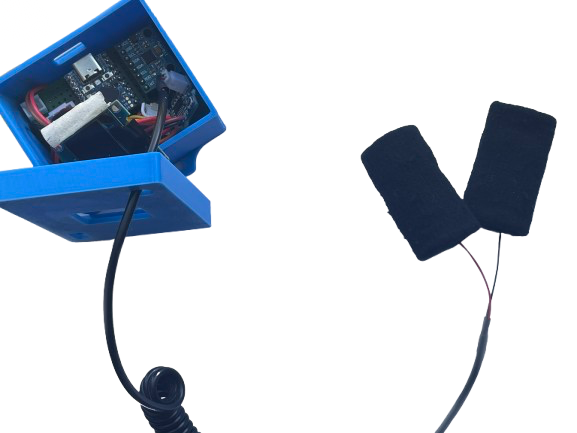
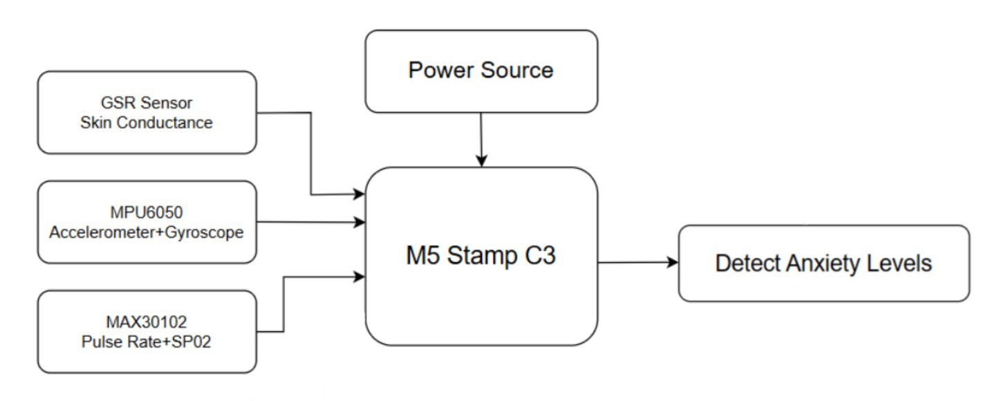
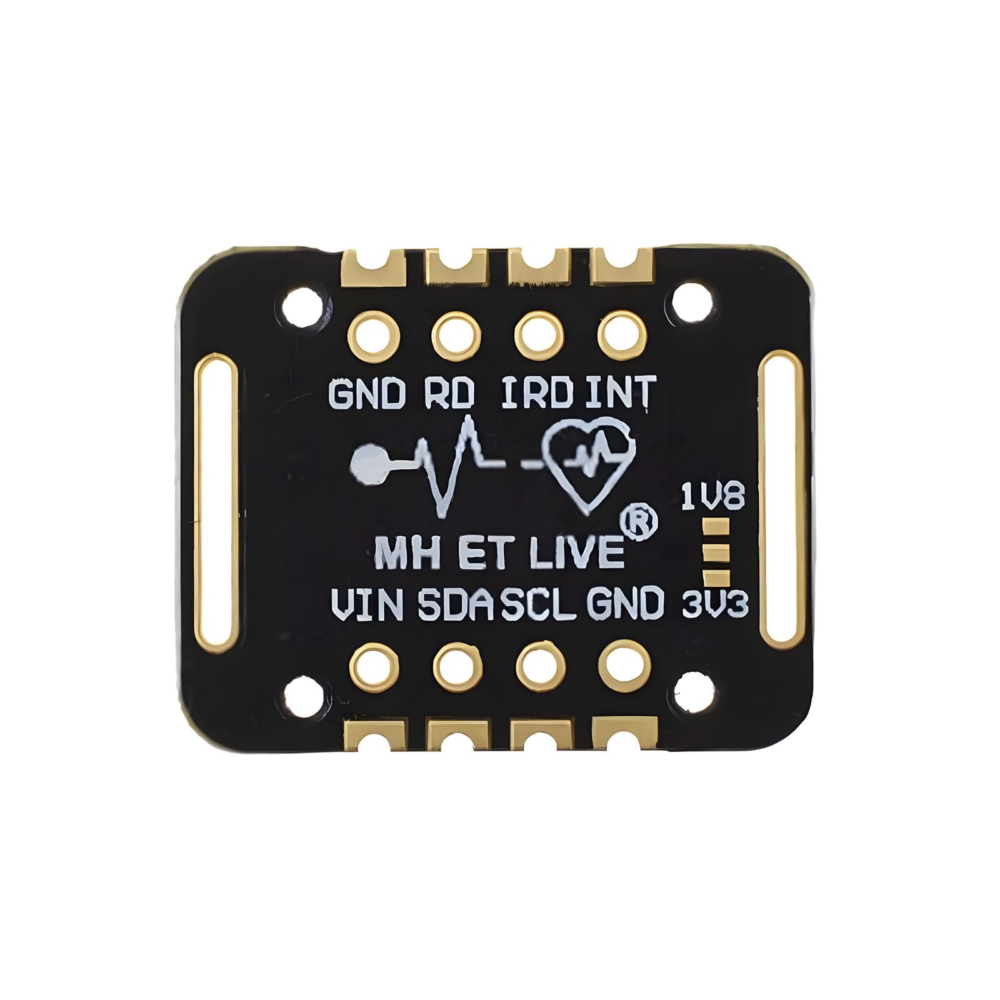
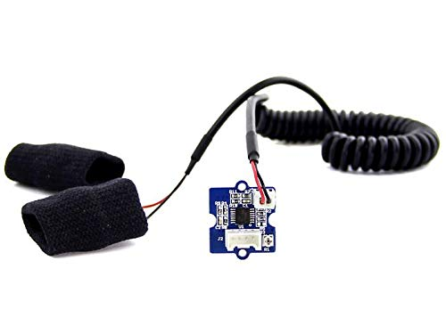
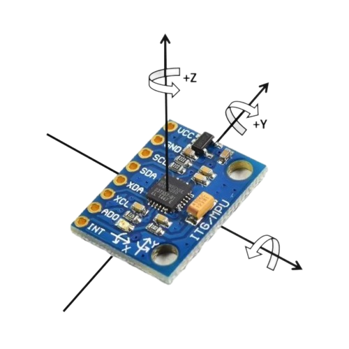
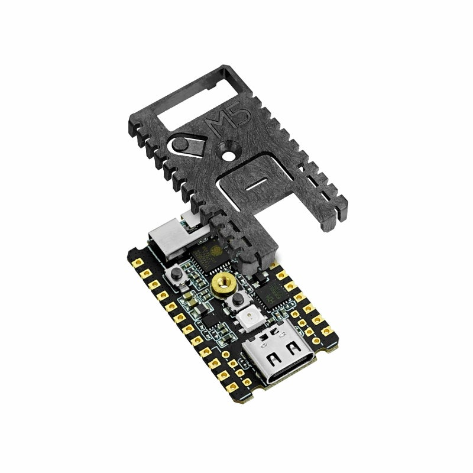

# SmartWear
### Multi-Sensor Wearable for Real-Time Performance Anxiety Monitoring

<p align="center">
  
</p>

<p align="center">
A wearable embedded system that monitors physiological indicators associated with performance anxiety using multiple biosensors, real-time signal processing, and Bluetooth communication.
</p>

<p align="center">

🎥 **Project Demo**

*Replace this with your GitHub video or GIF once uploaded.*

</p>

---

## Overview

SmartWear is an embedded wearable device designed to monitor physiological responses associated with performance anxiety in precision sports such as archery.

The system continuously collects biometric data from multiple sensors—including heart rate, blood oxygen saturation (SpO₂), galvanic skin response (GSR), body motion, and respiration—and processes the information on an **M5 Stamp C3** microcontroller. The processed data is displayed in real time on an OLED display while simultaneously being transmitted over Bluetooth to an external computer for monitoring and visualization.

Unlike traditional fitness wearables that prioritize long-term health tracking, SmartWear focuses on **real-time physiological monitoring** with low-latency processing suitable for training and research environments.

---

# Features

- 📈 Real-time physiological monitoring
- ❤️ Heart Rate & Blood Oxygen (SpO₂) sensing
- ✋ Galvanic Skin Response (GSR) monitoring
- 🏹 Motion and tremor detection using an IMU
- 🌬️ Respiration monitoring
- 📟 Live OLED display
- 📶 Bluetooth communication
- 🔋 Portable battery-powered embedded device
- ⚡ Firmware written in Arduino C++

---

# Hardware Components

| Component | Purpose |
|-----------|---------|
| M5 Stamp C3 | Main microcontroller |
| MAX30102 | Heart Rate & SpO₂ Sensor |
| GSR Sensor | Measures skin conductance |
| MPU6050 | Accelerometer & Gyroscope |
| SEN-10245 | Respiration Sensor |
| OLED Display | Displays live sensor readings |
| LiPo Battery | Portable power supply |

---

# System Architecture

<p align="center">

</p>

The SmartWear system continuously gathers physiological data from multiple biosensors. Sensor readings are processed on the M5 Stamp C3 before being displayed locally and transmitted via Bluetooth to an external computer for monitoring.

---

# Hardware

## MAX30102 Pulse & SpO₂ Sensor

<p align="center">

</p>

Measures:

- Heart Rate
- Blood Oxygen Saturation (SpO₂)
- Heart Rate Variability (HRV)

---
## GSR Sensor

<p align="center">

</p>

The Galvanic Skin Response (GSR) sensor measures changes in skin conductance caused by sweat gland activity. Since electrodermal activity increases with sympathetic nervous system activation, GSR provides a reliable indicator of physiological arousal and stress.

**Measures**
- Skin conductance
- Electrodermal activity (EDA)
- Physiological arousal

---

## MPU6050 Accelerometer & Gyroscope

<p align="center">

</p>

The MPU6050 combines a three-axis accelerometer and three-axis gyroscope to detect movement and tremors. It enables the system to monitor subtle motion that may indicate increased physiological stress.

**Measures**
- Linear acceleration
- Angular velocity
- Motion
- Tremor

---

  
## M5 Stamp C3 Microcontroller

<p align="center">

</p>

Responsibilities:

- Reads all sensor inputs
- Coordinates data acquisition
- Processes sensor data
- Updates the OLED display
- Manages Bluetooth communication

---

## Hardware Prototype

<p align="center">

</p>

---

# Data Flow

```text
          GSR Sensor
               │
               │
MAX30102 ──────┤
               │
MPU6050 ───────┤
               │
SEN-10245 ─────┤
               │
               ▼
        M5 Stamp C3
               │
       ┌───────┴────────┐
       │                │
       ▼                ▼
 OLED Display      Bluetooth
                         │
                         ▼
             Computer Monitoring
```

---

# Software Stack

- Arduino C++
- M5 Stamp C3
- Bluetooth Low Energy (BLE)
- Wire (I²C)
- MAX30102 Library
- MPU6050 Library
- OLED Graphics Library

---

# Project Structure

```text
SmartWear/
│
├── SmartWear_Firmware.ino
│
├── images/
│   ├── prototype.PNG
│   ├── system-architecture.jpg
│   ├── max30102.jpg
│   ├── m5-stampc3.jpg
│   └── demo.gif
│
├── README.md
│
└── LICENSE
```

---

# Technical Highlights

This project demonstrates experience with:

- Embedded Systems
- Firmware Development
- Arduino Programming
- Bluetooth Low Energy (BLE)
- I²C Communication
- Multi-Sensor Integration
- Real-Time Data Acquisition
- Wearable Device Design
- Hardware Prototyping
- Signal Processing
- Sensor Integration
- PCB-Friendly Embedded Design

---

# Engineering Challenges

During development, one of the biggest challenges was integrating multiple sensors that operated at different sampling rates while maintaining reliable real-time performance. The firmware was designed to continuously collect data from each sensor over I²C, update the OLED display, and transmit readings over Bluetooth without interrupting data acquisition.

Additional challenges included minimizing noise in physiological signals, coordinating communication between hardware components, and creating a compact wearable system suitable for portable use.

---

# Future Improvements

Planned improvements include:

- Mobile companion application
- Long-term physiological data logging
- Machine learning–based physiological pattern recognition
- Cloud dashboard for visualization
- Improved wearable enclosure design
- Additional physiological sensing capabilities

---

# Skills Demonstrated

- Embedded Software Engineering
- Firmware Development
- Hardware Integration
- Sensor Fusion
- Real-Time Systems
- Bluetooth Communication
- Arduino Development
- Rapid Prototyping
- Signal Processing
- Wearable Technology
- Microcontroller Programming
- Electronics Prototyping

---

# Images Used

- `images/system-architecture.jpg` – Overall system architecture
- `images/max30102.jpg` – MAX30102 sensor module
- `images/m5-stampc3.jpg` – M5 Stamp C3 microcontroller
- `images/prototype.PNG` – Completed hardware prototype
- `images/demo.gif` *(optional)* – Live demonstration of the device

---

# Demo

Once uploaded to GitHub, replace this section with your project video or GIF.

Example:

```markdown
## Demo

https://github.com/user-attachments/assets/xxxxxxxx
```

or

```markdown
<p align="center">

</p>
```

A short 20–45 second demo showing the OLED updating with live sensor values and Bluetooth communication will make the repository much more engaging for recruiters.

---

# License

This project is licensed under the MIT License.
